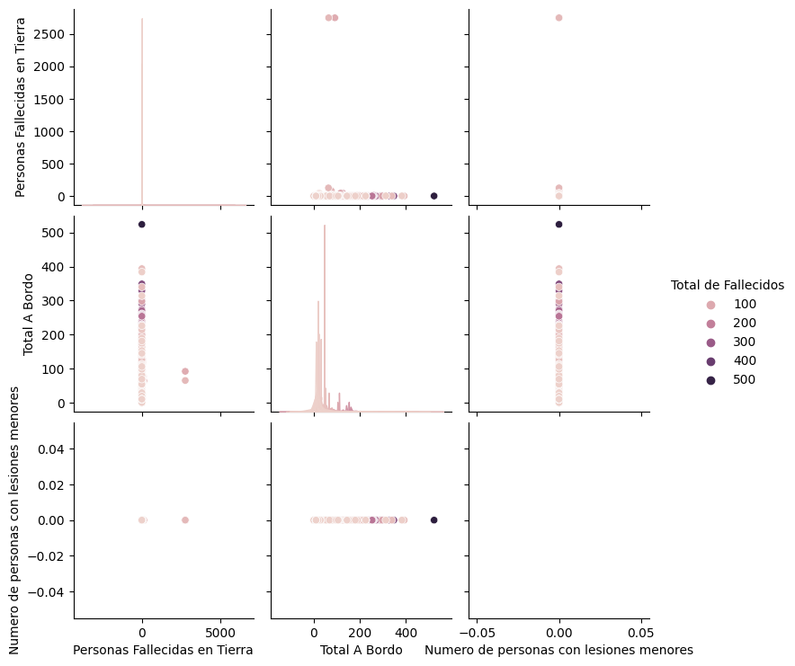
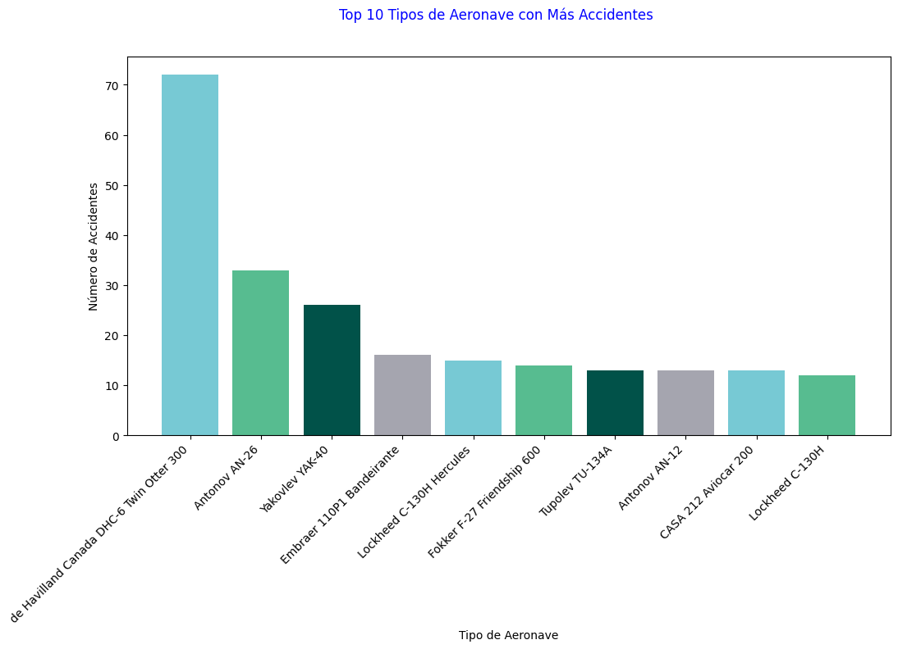

>

# <h1 align=center> **PROYECTO INDIVIDUAL # 2**</h1>

## **# Análisis de Accidentes de Aviones** 
### *Por Rojas Perez, Stefany (DS-10)*

Este repositorio contiene el análisis de los accidentes de aviones con referencia a la OACI (Organización de Aviación Civil Internacional).

## Introducción
El análisis de los accidentes de aviación es una disciplina crucial en la seguridad y la investigación de la aviación. Se enfoca en estudiar y comprender los factores que contribuyen a los accidentes aéreos.

En este proyecto, exploraremos los principios y las metodologías utilizadas en el análisis de accidentes de aviación

## Datos

Utilizaremos el dataset AcidentesAviones y tambien los dataset desde el año 2022 hasta el 2023 de National Transportation Safety Board ya que tiene los datos mas actualizados 

## Análisis

Realizamos un Grafico de Dispersion para ver como se relacionan las variables 

En el gráfico, podemos observar los siguientes patrones:

- Existe una relación positiva entre el "Total a Bordo" y el "Número de Personas con Lesiones". A medida que aumenta el número de personas a bordo, es más probable que se produzcan lesiones.
- También se observa una relación entre el "Total a Bordo" y las "Personas Fallecidas en Tierra". Los puntos más oscuros indican un mayor número de personas fallecidas en accidentes con un mayor total de pasajeros a bordo.
- Por otro lado, no parece haber una relación clara entre el "Número de Personas con Lesiones" y las "Personas Fallecidas en Tierra". Los puntos oscuros están dispersos en diferentes valores de lesiones y fallecidos en tierra.

Creamos un Grafico de Barra sobre las aeronaves con mas accidentes 

Aqui podemos ver que la aeronave con mayor numero de accidentes es Havilland Canada DHC-6 Twin Otter
-Esta aeronave conocido por su versatilidad y capacidad para operar en regiones remotas y difíciles. Esto implica que se utiliza en áreas geográficas y climáticas extremas, como montañas, selvas o zonas polares, donde las condiciones de vuelo pueden ser más desafiantes y aumentar el riesgo de accidentes.

- Ha estado en servicio durante varias décadas, lo que implica una mayor exposición y oportunidad para incidentes y accidentes en comparación con aeronaves más nuevas. Además, las aeronaves más antiguas pueden requerir un mantenimiento más intensivo y pueden ser más propensas a ciertos problemas mecánicos o de desgaste.

## Conclusiones

En este análisis, se examinaron varias variables relacionadas con los accidentes de avión, como el número de personas con lesiones, el total de personas a bordo y las personas fallecidas en tierra. Se realizó un gráfico de dispersión para visualizar la relación entre estas variables.

Se observaron puntos oscuros en el gráfico de dispersión, lo que indica una mayor concentración de fallecidos. Se identificaron conexiones entre las variables, como la relación entre el total de personas a bordo y el número de personas con lesiones, así como entre el total de personas a bordo y las personas fallecidas en tierra.

Además, se notó que la aeronave Havilland Canada DHC-6 Twin Otter ha experimentado una mayor cantidad de accidentes. Esto puede atribuirse a varios factores, como el uso en condiciones desafiantes, operaciones en pistas cortas, misiones especiales y el hecho de que ha estado en servicio durante varias décadas.

## Link del Dashboard

